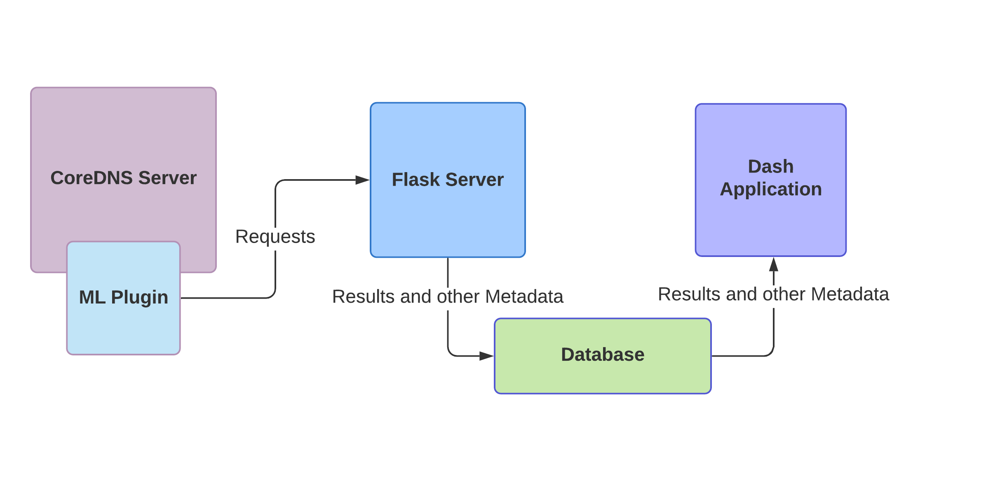
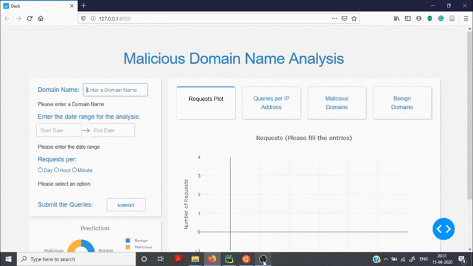

# CoreDNS Machine Learning Plugin

This CoreDNS plugin connects CoreDNS server to Machine Learning Environment for
DNS request and response analysis, monitoring and alerting. 

## Overview 

This plugin is the result of my work on a project during GSoC 2020. The goal of 
the project was introducing the integration of machine learning capabilities
into CoreDNS server functions.

The initial use case was the identification of the DNS requests for the records
of the domains that could be used by malicious hackers and other computer 
criminals. Upon the identification of the requests the plugin would either alert
the sysadmin or block the requests and responses.  

## Approach

### Application Middleware

Currently, Golang doesn't have native libraries for the interaction with the 
CUDA platform. At the same time, the Python ecosystem has tools like TensorFlow,
PyTorch, MXNet and various others that not only interact with the CUDA platform
but also allows for the easy prototyping and evaluation of deep learning models. 

This project combines the deep learning capabilities that the Python ecosystem
provides by creating a Python Middleware. The plugin intercepts a request 
and forwards it to Python middleware for further processing. 

The middleware is a Python Flask Server that receives the request along with 
other metadata. The Flask Server infers whether the request was malicious or 
benign via a pre-trained TensorFlow model and then stores the result along with
other metadata to a database.

The results and other metadata are visualized and analysed via a Dash
application. 

### Machine Learning

#### Learning Dataset

The deep-learning model is trained on a COVID-19 Cyber Threat Coalition 
Blacklist for malicious domains that can be found 
[here](https://blacklist.cyberthreatcoalition.org/vetted/domain.txt) and on a 
list of benign domains from DomCop that can be found 
[here](https://www.domcop.com/top-10-million-domains). 

Currently, the pre-trained model has been trained on the top 500 domain names 
from both these datasets. The final version of the pre-trained model will be 
trained on the entirety of both the datasets.  

#### Learning Process 

__Data Preprocessing:__ Each domain name is converted into a unicode code point 
representation and then extended to a numpy array of a length 256. The dataset 
was created by combining the malicious domains as well as the non-malicious. 
The dataset was split as follows:
- Train Set: 80% of the dataset.
- Validation Set: 10 % of the dataset
- Test Set: 10% of the dataset

__Training:__ The deep-learning model is a Convolutional Neural Net that is 
trained using stochastic gradient descent with the Adam optimizer.

## Implementation

### TensorFlow Model

#### Tensorflow Model Definition

The pre-trained deep learning model is a Convolutional Neural Net whose input is
a (16, 16, 1) shaped array and the output is a single value lying in between 0 
and 1. If the output value is less than 0.5 the domain name is considered benign
, else it is considered malicious. 

The model summary can be found below:

| Layer      | Output Shape          | Activation   | Number of Parameters |
|:----------:|:---------------------:|:------------:|:--------------------:|
| Input      | (None, 16, 16, 1 )    | -            |0                     |
| Conv2D     | (None, 15, 15, 16)    | Relu         |80                    |
| MaxPooling | (None, 7, 7, 16)      | -            |0                     |
| Conv2D     | (None, 6, 6, 16)      | Relu         |1040                  |
| MaxPooling | (None, 3, 3, 16)      | -            |0                     |
| Conv2D     | (None, 2, 2, 8 )      | Relu         |520                   |
| Flatten    | (None, 32)            | -            |0                     |
| Dense      | (None, 8 )            | Relu         |264                   |
| Dense      | (None, 1 )            | Sigmoid      |9                     |

#### TensorFlow Model Visualization

The model can be visualized as follows: 

#### Results

The accuracy for the Train Set, Validation Set and Test Set is as follows:

| Metric   | Train Set   | Validation Set | Test Set |  
|----------|-------------|----------------|----------|
| Accuracy | 99.25 %     | 98.00 %        | 98.00 %  |

For more information, the model training procedure as well as the saved model 
can be found in this 
[repository](https://github.com/Chanakya-Ekbote/dns_alert_model).

### CoreDNS Build

TODO

### Application Middlware with Flask

The middleware is a Python Flask Server that contains the pre-trained 
Convolutional Neural Network. The Flask Server receives the domain name queried 
as well as the IP address of the machine used to query that particular domain as
a JSON message via HTTP POST requests from the plugin.  

Once the Flask Server receives the domain name and the IP address, the domain 
name is preprocessed and then passed to the pre-trained deep learning model. The
deep learning model then classifies whether the domain name is of a malicious 
website or not.

The classification result as well as other metadata such as the IP address, the 
date and time of the request are stored in a NoSQL database, namely 
Elasticsearch, due to which storing and querying the classification result and 
the metadata is a fast process. 

Before running the Flask Server, it is recommended that the Elasticsearch server
is running in the background. To install Elasticsearch, please follow the 
instructions found on this 
[page](https://phoenixnap.com/kb/install-elasticsearch-ubuntu). Once 
Elasticsearch is installed, `cd` into it and use `bin/elasticsearch` to run the 
Elasticsearch server. 
 
To run the Flask Server, use `cd` into the `flask_server` directory and then use
`python dns_monitoring_server.py` in the command line. 

### Testing Harness

TODO

### Visualization Dashboard

To analyse and visualize the results stored in the in the Elasticsearch 
database, a Dash Application was created. A small demo of the application can be
seen below:

The Dash App has three main uses:
- __Domain Name Analysis__: 

 

#### Data Repository 

[Elasticsearch](https://www.elastic.co/), which leads to a faster performance than loading and updating a simple Json 
file every time. The project requires `Elasticsearch 7.7.1` or higher. The Elasticsearch server has to run on the
background while storing or updating queries.  

#### Data Visualization

The results will further be analysed (TBC) using a graphing library such as [Dash.](https://plotly.com/dash/)